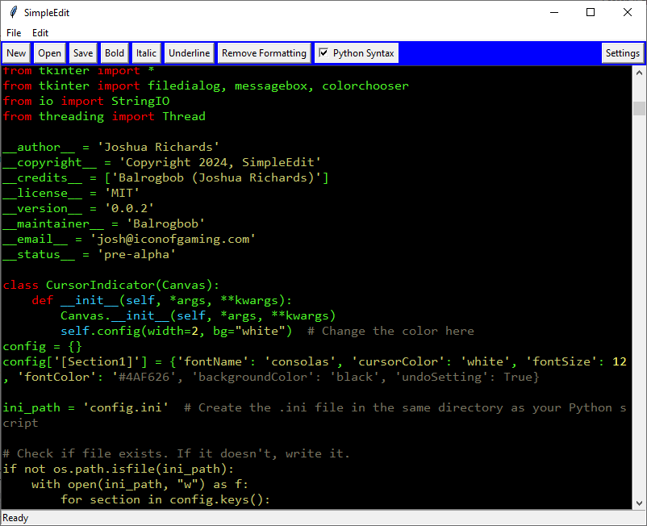

# SimpleEdit
Got Bored, decided to start with nothing and just code whatever came into my head. Turns out that was a python code editor to write the code for the editor I am writing. Has basic syntax highlighting, save and load functionality, and you can make text bold. ~~But you can't unmake it bold.~~ **YOU CAN NOW MAKE IT _UNBOLD_.** Also doesnt use any non-standard libraries, a fresh python install is enough. Uses Tkinter for GUI, and badly written unoptimized but threaded code to do the saving, loading, and highlighting.

