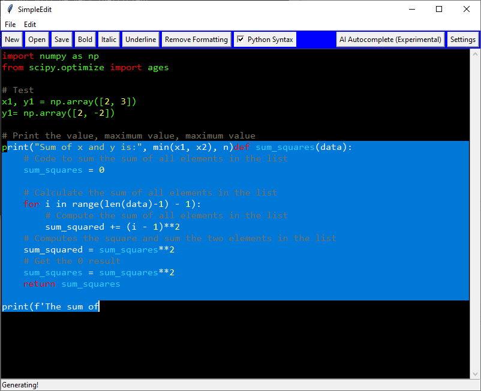
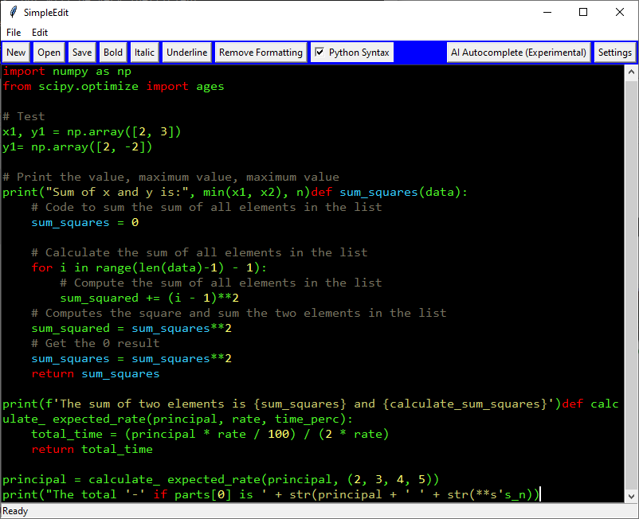

# ✨ SimpleEdit

> A lightweight, batteries-included Python code editor built with Tkinter

<div align="center">

[](LICENSE.txt)
[](https://www.python.org/)
[](#)

</div>

---

## 📚 Table of Contents

- [About](#-about)
- [Features](#-core-features)
- [Quick Start](#-quick-start)
- [Usage](#-usage)
- [Configuration](#-configuration)
- [Project Structure](#-project-structure)
- [Testing](#-testing)
- [Development](#-development)
- [License](#-license)

---

## 🎯 About

SimpleEdit started as a weekend project and has evolved into a comprehensive development environment for both Python and **rAthena (Ragnarok Online) server development**. Features advanced **syntax highlighting**, **text formatting**, **code validation**, and integrated **rAthena script development tools**.

> **Complete rAthena Toolkit:** Generate NPCs, validate scripts, manage YAML databases, and more - all from within the editor! 🎮

### ⚡ Quick Stats

| Feature | Details |
|---------|---------|
| 🎨 **Pure Tkinter** | No external GUI dependencies required |
| ⚙️ **Threaded** | Responsive UI with background syntax highlighting |
| 🎮 **rAthena Tools** | Complete NPC/script development and validation toolkit |
| 🔍 **Validators** | Script and YAML database validation with auto-fix suggestions |
| 🤖 **Optional AI** | GPT-2 based code suggestions (if ML libraries available) |
| 🌐 **HTML/Markdown** | Parse and render web documents |
| 🖥️ **Cross-Platform** | Windows executable or Linux/Mac via source

## 📸 Screenshots

| Main Editor | Rendered View |
|---|---|
|  |  |

---

## 🚀 Core Features

### 🎮 rAthena Script Development Tools (NEW!)

Complete toolkit for rAthena (Ragnarok Online) server development:

| Feature | Description |
|---------|-------------|
| ✅ **Script Validator** | Validate NPC scripts with detailed error reporting |
| ✅ **YAML Database Validator** | Validate quest_db.yml, item_db.yml, mob_db.yml with fallback parser |
| 🎨 **NPC Wizard** | Interactive step-by-step NPC creation |
| 💬 **Dialog Builder** | Visual dialog flow designer |
| 📜 **Script Generator** | Programmatic NPC/function generation |
| 📋 **Quick Templates** | Pre-built NPC templates for common patterns |
| 🔍 **Syntax Highlighting** | Full rAthena NPC script and YAML support |

**Validation Features:**
- ✅ Syntax errors (missing semicolons, brackets, quotes)
- ✅ Indentation problems (tabs/spaces mixing)
- ✅ Invalid commands and typos
- ✅ YAML structure and schema compliance
- ✅ Auto-fix suggestions for common issues
- ✅ Works offline (fallback YAML parser included)

[📖 Complete rAthena Tools Guide](PythonApplication1/docs/RATHENA_TOOLS_MENU.md)

---

### 📝 Text Editing & Formatting

| Feature | Description |
|---------|-------------|
| 🎨 **Syntax Highlighting** | Dynamic Python code highlighting with configurable colors and keywords |
| 📋 **Text Formatting** | Toggle bold, italic, underline, small text on selections |
| 📑 **Multiple Tabs** | Open multiple files simultaneously with tabbed interface |
| ↩️ **Undo/Redo** | Full undo/redo support (configurable via settings) |
| 🔍 **Find/Replace** | Built-in find and replace functionality |
| 📍 **Go To Line** | Navigate to specific line numbers (`Ctrl+G`) |

### 💾 File Management

| Feature | Description |
|---------|-------------|
| 📁 **Save/Load** | Standard file operations with error handling |
| 🕐 **Recent Files** | MRU list with quick-open from menu (persisted to `config.ini`) |
| 📄 **Multiple Formats** | Support for plain text, HTML, Markdown, and more |
| 🔎 **Auto-detect** | Detects HTML/Markdown content and parses to readable text |
| 📤 **Export** | Save with syntax highlighting as formatted Markdown or HTML |

### 🌐 HTML/Markdown Rendering

| Feature | Description |
|---------|-------------|
| 🏷️ **HTML Parsing** | Converts HTML fragments to readable plain text with metadata |
| 📊 **Table Support** | Preserves table structure with cell attributes (colspan, rowspan, alignment) |
| 💾 **Code Blocks** | Renders `<pre>`/`<code>` blocks with language-specific syntax highlighting |
| 🔗 **Link Extraction** | Captures and preserves hyperlinks with metadata |
| 📐 **Smart Whitespace** | Intelligent HTML parsing that preserves content structure |

**Supported Code Languages:** Python • JSON • JavaScript • HTML • YAML • C/C++ • Markdown • **rAthena NPC** • **rAthena YAML**

### ⚡ JavaScript Execution (Experimental)

| Feature | Description |
|---------|-------------|
| 📜 **Script Loading** | Extracts and executes `<script>` tags from HTML documents |
| ⚙️ **jsmini Engine** | Custom lightweight JavaScript interpreter |
| 🎯 **DOM Simulation** | Basic DOM API support for element manipulation |
| 🔌 **Host Callbacks** | Scripts can call `host.setRaw()` to update document content |
| 💬 **JS Console** | Optional popup console for script output and debugging |
| ⚠️ **Error Context** | Detailed error reporting with source code snippets |

### 🤖 AI Features (Optional)

**Requirements:** `torch` and `tiktoken`

| Feature | Description |
|---------|-------------|
| 💡 **AI Autocomplete** | GPT-2 based code suggestion |
| ⚡ **Smart Loading** | Lazy-loads AI model with progress feedback |
| 🪟 **Context Window** | Configurable token context (default: 512 tokens) |
| 🌡️ **Temperature Control** | Adjustable sampling temperature and top-k parameters |
| 🎮 **UI Controls** | Load/unload model from toolbar |
| 💾 **Persistent** | AI preferences saved to config file |

### ⚙️ Configuration & Customization

| Feature | Description |
|---------|-------------|
| 🔤 **Font Selection** | Dropdown for font family and size |
| 🎨 **Color Scheme** | Customizable colors for syntax elements (stored in `config.ini`) |
| 🏷️ **Tag Colors** | Per-element color configuration (keywords, strings, comments, etc.) |
| 📋 **Syntax Presets** | Load custom syntax highlighting rules from `.ini` files |
| 🎨 **CSS Modes** | Choose inline, inline-block, or external CSS for HTML export |

---

## 🚀 Quick Start

### 📥 Installation

#### Option 1: Run from Source

```bash
git clone https://github.com/balrogbob/SimpleEdit.git
cd SimpleEdit
python PythonApplication1.py
```

#### Option 2: Windows Executable (No Python Required!)

```bash
# Download PythonApplication1.exe from releases
./PythonApplication1.exe
```

#### Option 3: Linux/Mac via Wine

```bash
wine PythonApplication1.exe
```

### 📦 Dependencies

#### Required
- Python 3.8+
- `tkinter` (built-in with most Python installations)

#### Optional
- `pyyaml` - YAML database validation (falls back to built-in parser if not available)
- `torch` - AI autocomplete
- `tiktoken` - AI tokenizer
- `pyinstaller` - Build Windows executable

---

## 📖 Usage

### rAthena Script Development

**Access via:** `rAthena Tools` menu

1. **Validate Scripts** - `rAthena Tools` → `Validate Script`
   - Checks syntax, indentation, commands
   - Reports errors with line numbers
   - Suggests fixes

2. **Validate YAML Databases** - `rAthena Tools` → `Validate YAML Database`
   - Validates quest_db.yml, item_db.yml, mob_db.yml
   - Schema compliance checking
   - Works without PyYAML (fallback parser)

3. **Create NPCs** - `rAthena Tools` → `NPC Wizard`
   - Interactive NPC creation
   - Dialog flow design
   - Quick templates

4. **Insert Templates** - `rAthena Tools` → `Insert Quick NPC`
   - Pre-built NPC patterns
   - Merchant, healer, warper templates

[📖 rAthena Tools Documentation](PythonApplication1/docs/RATHENA_TOOLS_MENU.md)

---

### Basic Workflow

1. **New File** — `File` → `New` or `Ctrl+N`
2. **Open File** — `File` → `Open` or use Recent menu
3. **Edit** — Type in main text area; formatting applied automatically
4. **Apply Formatting** — Select text → `Edit` menu → choose **Bold/Italic/Underline**
5. **Save** — `File` → `Save` or `Ctrl+S`
6. **Export** — `File` → `Save as Markdown` (preserves syntax highlighting)

### HTML/Markdown Mode

When opening `.html`, `.md`, or `.php` files:

- ✅ Content is automatically parsed and displayed as readable text
- ✅ Original HTML is preserved internally
- ✅ Toggle between raw and rendered views via menu

### JavaScript Execution

1. Open an HTML file containing `<script>` tags
2. Scripts automatically extract and execute
3. Check `Settings` → `Enable debug logging` for detailed execution trace
4. Output appears in optional JS Console (`Settings` → menu option)

### AI Autocomplete

1. Click `AI Autocomplete` button in toolbar
2. Model loads automatically on first use (~30 seconds)
3. Suggestion appears after loading completes
4. Unload model via `AI Unload` button when not needed

---

## ⌨️ Keyboard Shortcuts

| Shortcut | Action |
|----------|--------|
| `Ctrl+N` | New file |
| `Ctrl+O` | Open file |
| `Ctrl+S` | Save |
| `Ctrl+Shift+S` | Save As |
| `Ctrl+Z` | Undo |
| `Ctrl+Y` | Redo |
| `Ctrl+H` | Find & Replace |
| `Ctrl+G` | Go to Line |
| `Ctrl+W` | Close Tab |
| `Ctrl+B` | Toggle Bold |
| `Ctrl+I` | Toggle Italic |
| `Ctrl+U` | Toggle Underline |

---

## ⚙️ Configuration

Configuration is stored in **`config.ini`** (created automatically on first run).

### Example Configuration

```ini
[Section1]
fontName=consolas
fontSize=12
fontColor=#4AF626
backgroundColor=black
cursorColor=white
syntaxHighlighting=True
aiMaxContext=512
temperature=1.1
top_k=300
jsConsoleOnRun=False
debug=False

[Recent]
files=["path/to/file1.py", "path/to/file2.html"]

[URLHistory]
urls=["https://example.com"]
```

### Configuration Options

| Option | Type | Default | Description |
|--------|------|---------|-------------|
| `fontName` | string | `consolas` | Font family for editor |
| `fontSize` | int | `12` | Font size in points |
| `fontColor` | hex | `#4AF626` | Text color |
| `backgroundColor` | hex | `black` | Background color |
| `syntaxHighlighting` | bool | `True` | Enable syntax highlighting |
| `aiMaxContext` | int | `512` | AI context window (tokens) |
| `temperature` | float | `1.1` | AI sampling temperature |
| `jsConsoleOnRun` | bool | `False` | Auto-open JS console |
| `debug` | bool | `False` | Enable debug logging |

---

## 📁 Project Structure

```
SimpleEdit/
├── 📄 PythonApplication1.py          # Main GUI application
├── 📄 functions.py                   # Helper functions (HTML, scripts, etc.)
├── 📄 jsmini.py                      # JavaScript interpreter
├── 📄 js_builtins.py                 # JS built-in functions
├── 📄 model.py                       # GPT model (if ML available)
├── 📄 syntax_worker.py               # Background syntax highlighting
├── 📄 rathena_tools_menu.py          # ✨ NEW: rAthena tools integration
├── 📄 rathena_yaml_validator.py      # ✨ NEW: YAML validator with fallback parser
├── 📄 config.ini                     # Runtime configuration
│
├── 📁 rathena-tools/                 # ✨ NEW: rAthena toolkit package
│   ├── 📄 __init__.py
│   ├── 📄 rathena_script_gen.py      # Script generator
│   ├── 📄 rathena_script_ui.py       # UI helpers
│   ├── 📄 README.md                  # Package documentation
│   ├── 📄 RATHENA_SCRIPT_GUIDE.md    # 9-chapter guide
│   └── 📄 QUICK_REFERENCE.md         # Command reference
│
├── 📁 templates/                     # ✨ NEW: Script templates
│   ├── 📄 template.npc               # NPC template
│   └── 📄 template.yml               # YAML database template
│
├── 📁 docs/                          # Documentation
│   ├── 📄 INDEX.md                   # Master documentation index
│   ├── 📄 RATHENA_TOOLS_MENU.md      # ✨ NEW: rAthena tools guide
│   ├── 📄 YAML_VALIDATOR.md          # ✨ NEW: YAML validation guide
│   └── [other docs]
│
├── 📁 tests/                         # Test suite
│   ├── 📄 test_base.py
│   ├── 📄 test_rathena_integration.py  # ✨ NEW: rAthena tests
│   └── __init__.py
│
└── 📁 syntax/                        # Syntax definition files
    ├── 📄 python.ini
    ├── 📄 json.ini
    ├── 📄 yaml.ini
    ├── 📄 cpp.ini
    ├── 📄 csharp.ini
    └── ...
```

---

## 🧪 Testing

Located in `PythonApplication1/tests/` directory:

| Test File | Purpose |
|-----------|---------|
| `test_base.py` | Core functionality tests |
| `test_js_builtins.py` | JavaScript built-in functions |
| `test_js_builtins2.py` | Extended JS builtins testing |
| `test_json_reviver.py` | JSON parsing and reviver patterns |
| `test_object_helpers.py` | Object manipulation utilities |
| `test_run_scripts_update.py` | Script execution & DOM handling |
| `test_dom_events.py` | DOM event dispatching |
| `test_event_builtin.py` | Event system built-ins |
| `test_tokendiag_run_test.py` | Syntax tokenization |

### Running Tests

```bash
# Run all tests
python -m pytest PythonApplication1/tests/

# Run specific test file
python -m pytest PythonApplication1/tests/test_base.py

# Run with verbose output
python -m pytest PythonApplication1/tests/ -v
```

---

## 👨‍💻 Development

### Code Standards

- **Indentation:** 4 spaces
- **Naming:** `snake_case` for functions/variables, `CamelCase` for classes
- **Exception Handling:** Defensive, best-effort approach to keep UI responsive
- **Testing:** Add tests for non-trivial logic
- **Configuration:** Use explicit keys in `config.ini` under `Section1`

### Thread Safety

| Component | Threading Model |
|-----------|-----------------|
| **Syntax Highlighting** | Background worker thread |
| **Script Execution** | Daemon thread (async by default) |
| **File I/O** | Threaded to keep UI responsive |
| **GUI Updates** | Scheduled via `.after()` for main thread safety |

### Key Dependencies

**Required:**
- `tkinter` (built-in with Python)

**Optional:**
- `torch` - AI autocomplete
- `tiktoken` - AI tokenizer
- `pyinstaller` - Windows executable building

---

## ⚠️ Known Limitations

| Limitation | Details |
|-----------|---------|
| 💾 **AI Memory** | AI model requires significant memory (~500MB+) |
| 📜 **JS API** | JavaScript interpreter is simplified; not all browser APIs available |
| 📊 **Table Editing** | Best-effort only (metadata preserved but limited UI) |
| ⚡ **Performance** | Syntax highlighting may lag on very large files (>50KB) |

---

## 🤝 Contributing

Contributions are welcome! Please see [CONTRIBUTING.md](CONTRIBUTING.md) for guidelines.

### Code Style

Follow PEP 8 with the additions in our style guide:
- Use type hints where applicable
- Add docstrings to public functions
- Keep functions focused and testable

---

## 📜 License

This project is licensed under the **MIT License** — see [LICENSE.txt](LICENSE.txt) for details.

---

## 👤 Author

**Joshua Richards**  
Created as a fun programming project • [GitHub](https://github.com/balrogbob/SimpleEdit)

---

## 💬 Support

For issues, questions, or suggestions:

- 🐛 [Report a Bug](https://github.com/balrogbob/SimpleEdit/issues)
- ✨ [Request a Feature](https://github.com/balrogbob/SimpleEdit/issues)
- 🔍 Check existing issues for similar problems

---

## 📚 Documentation Hub

> **📖 Start Here:** [Documentation Index](PythonApplication1/docs/INDEX.md) - Complete navigation guide

### 🚀 Getting Started
- 🎯 [Quick Start Guide](PythonApplication1/docs/QUICKSTART.md) - Get started in 5 minutes
- 📥 [Installation Guide](PythonApplication1/docs/INSTALLATION.md) - Setup for any OS
- ⚡ [Editor Features](PythonApplication1/docs/EDITOR-USAGE.md) - Complete feature guide

### 🎮 rAthena Development
- 📖 [rAthena Tools Guide](PythonApplication1/docs/RATHENA_TOOLS_MENU.md) - **Complete toolkit reference**
- ✅ [Script Validator](PythonApplication1/docs/VALIDATOR_MULTILINE_COMMENT_FIX_SIMPLE.md) - Validate NPC scripts
- ✅ [YAML Validator](PythonApplication1/docs/YAML_VALIDATOR.md) - Validate databases
- 📜 [9-Chapter Script Guide](PythonApplication1/rathena-tools/RATHENA_SCRIPT_GUIDE.md) - Learn rAthena scripting
- ⚡ [Quick Reference](PythonApplication1/docs/RATHENA_TOOLS_QUICK_REF.md) - Command cheat sheet

### 🔧 Advanced Topics
- 🔌 [API Reference](PythonApplication1/docs/API.md) - All functions and features
- 🎨 [Syntax Highlighting](PythonApplication1/docs/SYNTAX.md) - Language support and colors
- ⚙️ [JavaScript Engine](PythonApplication1/docs/JSMINI.md) - jsmini interpreter guide
- 📈 [Performance Tuning](PythonApplication1/docs/PERFORMANCE-TUNING.md) - Optimize your setup
- 🍳 [Code Examples](PythonApplication1/docs/EXAMPLES.md) - Practical recipes

### 💬 Support
- 🆘 [Troubleshooting](PythonApplication1/docs/TROUBLESHOOTING.md) - Solutions to common problems
- 💬 [FAQ](PythonApplication1/docs/FAQ.md) - Frequently asked questions
- 🔧 [Contributing Guide](PythonApplication1/CONTRIBUTING.md) - How to contribute code

---

<div align="center">

**Made with ❤️ in Python**

Give us a ⭐ if you found this useful!

</div>
